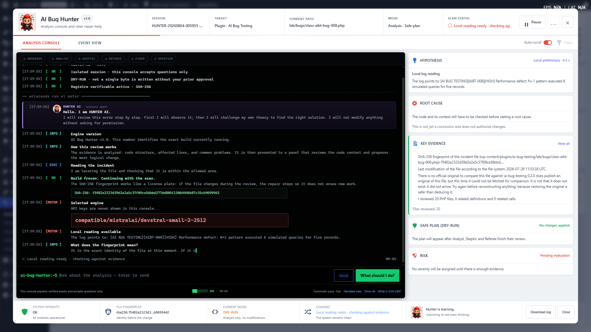

<p align="center">
  
</p>

<h1 align="center">AI Bug Hunter</h1>

<p align="center">
  Evidence-based diagnostics and supervised repair guidance for WordPress.
</p>

<p align="center">
  
  
  
  
</p>

<p align="center">
  <a href="#overview">Overview</a> ·
  <a href="#features">Features</a> ·
  <a href="#how-it-works">How it works</a> ·
  <a href="#installation">Installation</a> ·
  <a href="#privacy-and-external-services">Privacy</a> ·
  <a href="#license">License</a>
</p>

---

<p align="center">
  
</p>

<p align="center">
  <sub>Analysis Console — evidence review, hypothesis tracking, root-cause evaluation and safe planning.</sub>
</p>

---

## Overview

**AI Bug Hunter** is a WordPress diagnostic assistant designed to inspect incidents, organize technical evidence and explain possible causes before any change is considered.

The plugin combines local inspection with optional AI-assisted analysis. It is built around a supervised workflow: observe first, validate the evidence, challenge the initial hypothesis and prepare a reviewable plan.

> **Human authorization remains mandatory.** AI Bug Hunter does not treat an AI response as permission to modify a site.

## Features

| Area | Capability |
|---|---|
| **Local diagnostics** | Reads available logs and technical context without requiring an AI provider. |
| **Evidence-first analysis** | Builds findings from file context, fingerprints, related definitions and recorded events. |
| **Multi-role review** | Separates observation, analysis, skepticism, referee review, fixing and verification. |
| **Root-cause evaluation** | Avoids presenting preliminary signals as confirmed conclusions. |
| **Safe planning** | Produces a dry-run plan before any repair workflow is considered. |
| **File fingerprinting** | Uses SHA-256 fingerprints to identify the exact file reviewed. |
| **Provider flexibility** | Supports Mistral, OpenAI, Anthropic and OpenAI-compatible endpoints. |
| **Bring your own key** | Uses credentials from the administrator's own provider account. |
| **Secret redaction** | Attempts to redact detectable keys, tokens, email addresses and IP addresses before transmission. |
| **Consent controls** | Requires explicit authorization before sending technical excerpts to an external provider. |
| **Audit visibility** | Keeps analysis events, evidence and current state visible inside the console. |
| **Reversible workflow** | Prioritizes reviewable proposals, backups, verification and rollback-aware operation. |

## How it works

1. **Observe**  
   AI Bug Hunter reads the available local evidence and identifies the affected context.

2. **Form a hypothesis**  
   The analysis engine proposes a preliminary explanation without presenting it as final.

3. **Challenge the hypothesis**  
   Skeptic and Referee stages test whether the evidence actually supports the conclusion.

4. **Prepare a safe plan**  
   A dry-run plan explains the intended scope and expected effect before changes are authorized.

5. **Verify the result**  
   The final stage checks whether the incident was resolved and whether the system remains operational.

## Safety model

AI Bug Hunter is designed around the following principles:

- No conclusion without sufficient evidence.
- No hidden API-key display inside the analysis console.
- No repair authorization inferred from an AI response.
- No silent modification of `wp-config.php`.
- No externally generated change treated as trusted by default.
- No successful repair state without verification.
- No removal of unresolved findings merely because an attempted repair finished.

## AI providers

AI-assisted analysis is optional. Local log diagnosis can operate without an AI connection, while explanations and proposed fixes require a configured provider.

Supported provider modes include:

- **Mistral API**
- **OpenAI API**
- **Anthropic API**
- **OpenAI-compatible custom endpoint**

API usage, pricing, limits and data-retention terms are controlled by the selected provider.

## Installation

### From a ZIP file

1. Download the plugin ZIP.
2. In WordPress, open **Plugins → Add New Plugin**.
3. Select **Upload Plugin**.
4. Choose the ZIP file and install it.
5. Activate **AI Bug Hunter**.

### From the repository

```bash
git clone https://github.com/yamaangtaka/bughunter.git
```

Copy the repository directory into:

```text
wp-content/plugins/
```

Then activate the plugin from the WordPress administration panel.

## Initial configuration

1. Open **AI Bug Hunter → Settings**.
2. Select an AI provider or an OpenAI-compatible endpoint.
3. Enter the API key from your own provider account.
4. Review the external-service disclosure.
5. Grant consent only after reviewing what may be transmitted.
6. Save the settings.
7. Open the Analysis Console and begin a diagnostic session.

## Privacy and external services

When an external AI provider is enabled, the provider may receive limited technical excerpts required for analysis, such as:

- Error messages.
- Relative file paths.
- Relevant source-code excerpts.
- Technical evidence associated with the incident.
- Instructions required to evaluate the problem.

Before transmission, AI Bug Hunter attempts to redact detectable secrets and personal data. Redaction reduces exposure but cannot guarantee complete anonymity.

Administrators should review the privacy policy, terms and retention practices of the selected provider before granting consent.

## Operational notes

- Local diagnostics remain available without an AI provider.
- AI-generated analysis should be reviewed as technical guidance, not as an unquestionable conclusion.
- Test repairs in staging before using them on a production site.
- Maintain current backups before authorizing any code-related operation.
- Never publish logs or screenshots containing API keys, private paths, customer information or access credentials.

## Project status

AI Bug Hunter is under active development. Interfaces, workflows and supported providers may change while the project is refined.

Production use should follow an appropriate staging, backup and review process.

## Documentation

The repository uses two separate documentation files:

- **`README.md`** — GitHub project presentation and technical overview.
- **`readme.txt`** — WordPress plugin metadata and WordPress.org-compatible documentation.

## Contributing

Bug reports should include:

- AI Bug Hunter version.
- WordPress and PHP environment details.
- Reproduction steps.
- Expected and actual behavior.
- Sanitized logs or screenshots.
- Confirmation that secrets and customer data were removed.

Please avoid publishing credentials, API keys, access tokens or personally identifiable information.

## License

AI Bug Hunter is licensed under the **GNU General Public License v2.0**.

See [`LICENSE`](LICENSE) for the complete license text.

---

<p align="center">
  <strong>AI Bug Hunter</strong><br>
  Observe. Challenge. Verify.
</p>
